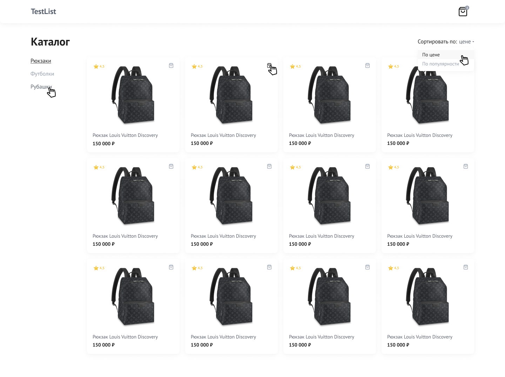
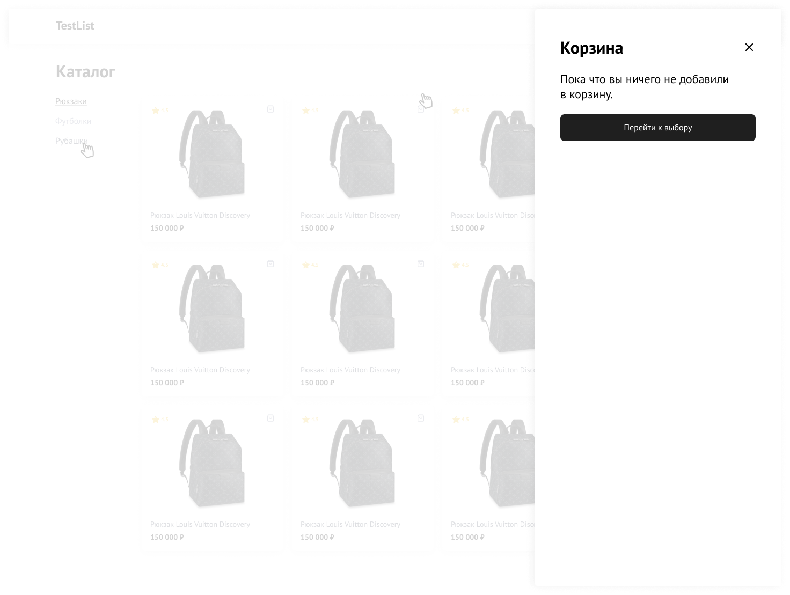

# Верстка интернет магазина

### Технологии которые использовал
- HTML
- SCSS (grid, flex, mixin)
- Методология BEM
- Верстка макета из FIGMA

[Страница дизайна](https://www.figma.com/file/QKPeUiMH4vHUQk0qccVopz/Untitled?node-id=1%3A307)

## Каталог

## Корзина

## Пустая корзина

